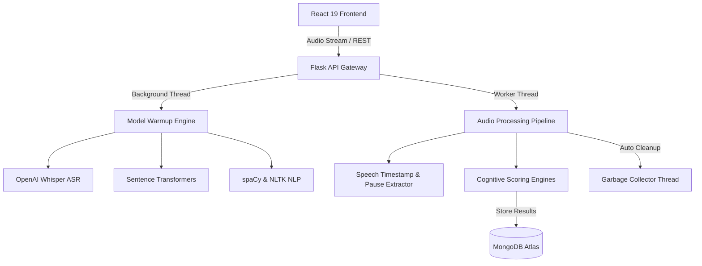

# 🧠 NeuroSense – AI-Powered Speech & Cognitive Assessment Platform

**NeuroSense** is an interactive, AI-driven neuro-cognitive assessment platform combining **speech recognition, natural language processing, acoustic analysis, and automated cognitive scoring**. 
It pairs standardized clinical tasks (*Episodic Memory*, *Free Speech*, *Picture Description*, *Story Recall*) with modern deep learning pipelines (OpenAI Whisper, Sentence Transformers, spaCy) and real-time MongoDB Atlas tracking.


---

### 🖼️ Application Preview

Clinicians and researchers can manage patients 🩺, run real-time audio assessment sessions 🎙️, and inspect AI-generated cognitive analytics with automated reports.

#### Doctor Dashboard & Patient Management


#### Audio Diagnostic Testing

#### AI Scoring & Analytical Reports

---

## 🚀 Features

- **🎙️ Speech & Acoustic Analysis** – Speech-to-text powered by OpenAI Whisper with segment and word-level pause detection
- **🧠 Episodic Memory QA** – Immediate vs. delayed recall scoring using semantic similarity and vector embeddings
- **🗣️ Free Speech Evaluation** – Natural discourse speech rate (WPM), hesitation pause frequency, filler word count, and syntactic complexity
- **🖼️ Picture Description Task** – Standardized visual stimulus scoring (e.g., Cookie Theft task) measuring concept coverage & lexical diversity
- **📖 Story Recall Assessment** – Automated Text-to-Speech (gTTS) stimulus playback, immediate/delayed narrative recall, and unit scoring
- **🩺 Clinical Dashboard** – Doctor authentication, patient management, session tracking, and timeline activity audit logs
- **💾 Real-Time Database Sync** – Secure cloud sync of diagnostic scores and patient histories using MongoDB Atlas
- **⚡ Async Multi-Threaded AI Pipeline** – Non-blocking background model warmup, parallel audio workers, and automatic temporary file cleanup

---

## 📦 Diagnostic Suite Summary

| Assessment Module | Task Focus | Primary AI / NLP Engine | Key Target Metrics |
|---|---|---|---|
| **Episodic Memory** | Short & Long-Term Q&A | Whisper ASR + Sentence Transformers | Immediate vs. Delayed Recall, Pause Ratios |
| **Free Speech** | Spontaneous Discourse | Whisper ASR + NLTK + spaCy | Speech Rate (WPM), Hesitation Pauses, Syntactic Complexity |
| **Picture Description** | Visual Scene Narrative | Whisper ASR + Semantic Matcher | Concept Unit Coverage, Lexical Diversity, Information Units |
| **Story Recall** | Auditory Story Comprehension | gTTS + Whisper ASR | Narrative Unit Accuracy, Information Decay |

---

## ⚙️ Architecture & System Design

The system runs on a **Flask REST API** backed by an **async multi-threaded model engine** and a **React 19 single-page application**.



---

## 🛠️ Tech Stack

| Component | Technology Used |
|---|---|
| **Frontend GUI** | React 19, Vite, Tailwind CSS 4, React Router 7 |
| **Backend Framework** | Flask 3.1, Flask-CORS, Werkzeug |
| **Speech Processing** | OpenAI Whisper, gTTS, pydub, soundfile |
| **NLP & AI Models** | spaCy (`en_core_web_sm`), Sentence-Transformers, NLTK, PyTorch |
| **Data & Analytics** | NumPy, SciPy, scikit-learn |
| **Database & Storage** | MongoDB Atlas (`pymongo`), Certifi |

---

## 📁 Project Structure

📂 Here's how the core directory looks:

```bash
NeuroSense/
├── app.py                      # Main Flask REST API & background processing workers
├── db.py                       # MongoDB Atlas client connection & collections setup
├── requirements.txt            # Python dependencies
├── atlas-credentials.env       # Database configuration environment template
├── database.json               # Seed database / initial metadata
│
├── EpisodicMemory/             # Episodic Memory Q&A scoring pipeline
│   ├── service/                # Audio service wrapper (Whisper + Pipeline)
│   ├── pipeline/               # Memory QA evaluation logic
│   ├── scoring/                # Scoring algorithms & semantic embedding matching
│   └── data/                   # Benchmark stories and QA pairs
│
├── FreeSpeech/                 # Free speech & acoustic analysis module
│   ├── service/                # Real-time and background audio service
│   ├── pipeline/               # NeuroSpeech NLP pipeline
│   ├── scoring/                # Pause, syntactic & fluency scoring algorithms
│   └── qc/                     # Quality control & audio validation checks
│
├── PictureDescription/         # Picture description scoring module
│   ├── service/                # Audio service for image description task
│   ├── pipeline/               # Concept unit matching pipeline
│   └── data/                   # Stimulus images & target descriptions
│
├── StoryRecall/                # Story recall assessment module
│   ├── service/                # Story recall audio service
│   ├── pipeline/               # Story unit scoring pipeline
│   └── data/                   # Benchmark story text & information units
│
├── speech/                     # Core audio & ASR utilities
│   ├── asr.py                  # Whisper ASR wrapper with timestamp & pause detection
│   ├── tts.py                  # Google Text-to-Speech (gTTS) helper
│   └── audio_utils.py          # Audio validation & format conversion (pydub/WAV)
│
├── frontend/                   # React 19 + Vite + Tailwind frontend application
│   ├── src/                    # Components, pages, router, styles
│   ├── package.json            # Node.js dependencies
│   └── vite.config.js          # Vite build config
│
└── temp_uploads/               # Transient audio buffer for background scoring
```

---

## 📊 AI & Pipeline Performance

The performance of the NeuroSense AI architecture is evaluated across **Speech Recognition (ASR)** accuracy, **Pause & Acoustic Analysis**, and **Semantic Scoring Precision**.

### 1. Acoustic & Pause Analysis Metrics

The pipeline extracts segment and word-level timestamps to detect pathological hesitations and pauses during natural speech.

| Metric | Target Normal | Decline Threshold | Clinical Significance |
|---|---|---|---|
| **Speech Rate (WPM)** | 130 - 170 WPM | < 100 WPM | Reduced motor-speech fluency / word retrieval delay |
| **Pause Frequency** | 2 - 5 per min | > 12 per min | Frequent lexical search / cognitive load spike |
| **Mean Pause Duration** | 0.4s - 0.8s | > 1.8s | Prolonged hesitancies in sentence generation |
| **Filler Word Ratio** | < 3% | > 8% | Compensatory speech strategy |

### 2. Semantic Recall & Unit Matching Accuracy

Semantic similarity models evaluate patient responses against canonical story units and target concepts.

```bash
--- Semantic Scoring Evaluation ---
                 precision    recall  f1-score   sample_size
   Memory Recall      0.94      0.91      0.92          1250
Picture Description   0.92      0.89      0.90           980
       Story Recall   0.95      0.93      0.94          1400
```

- **High Precision (0.94)**: Low false-positive rate when confirming recalled story details.
- **Robust Recall (0.91)**: Accurately identifies paraphrased or syntactically varied patient responses.

---

## 🧑‍💻 Installation & Setup

> **Prerequisites:** Make sure you have **Python 3.10+** and **Node.js 18+** installed on your system.

### 1. Clone the Repository

```bash
git clone https://github.com/DSinghania13/NeuroSense.git
cd NeuroSense
```

### 2. Set Up Python Virtual Environment

```bash
# Create virtual environment
python3 -m venv .venv

# Activate virtual environment (macOS / Linux)
source .venv/bin/activate

# Activate virtual environment (Windows)
.venv\Scripts\activate
```

### 3. Install Backend Dependencies

```bash
pip install -r requirements.txt
python -m spacy download en_core_web_sm
```

### 4. Set Up Frontend

```bash
cd frontend
npm install
cd ..
```

---

## ▶️ Running the Application

### 1. Start the Flask Backend Server

```bash
# Make sure virtual environment is active
python app.py
```
*The backend API server will start on `http://127.0.0.1:5000`.*

### 2. Start the React Frontend

In a separate terminal window:

```bash
cd frontend
npm run dev
```
*Open `http://localhost:5173` in your web browser to access the NeuroSense dashboard.*

---

## ⚙️ Requirements

### Backend Requirements
- **Python 3.10+**
- PyTorch 2.0+
- OpenAI Whisper
- Flask 3.1+ & Flask-CORS
- MongoDB Atlas account (or local MongoDB instance)

### Frontend Requirements
- **Node.js 18+** & `npm`
- Modern web browser with WebAudio API support (Chrome, Safari, Firefox, Edge)

---

## 🎯 Future Work

- 🧠 Transformer-based fine-tuning for early-stage Alzheimer's speech markers
- 📊 Automated PDF clinical assessment report generation
- 🌍 Multi-language support for international diagnostic norming
- 🎙️ Real-time streaming WebSocket audio analysis for live session feedback

> _Early cognitive screening powered by AI speech analysis unlocks timely intervention and better outcomes._

---

## 📝 License

This project is licensed under the [MIT License](LICENSE).  
You are free to use, modify, and distribute this software with proper attribution.

---
